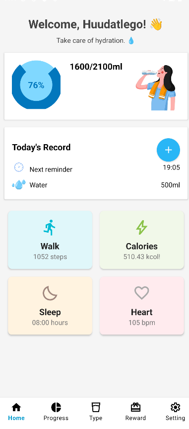
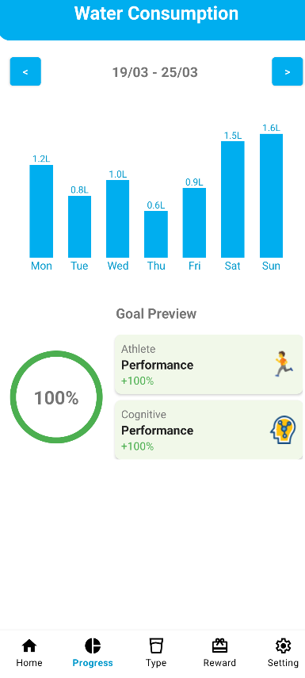
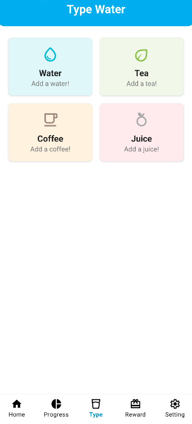
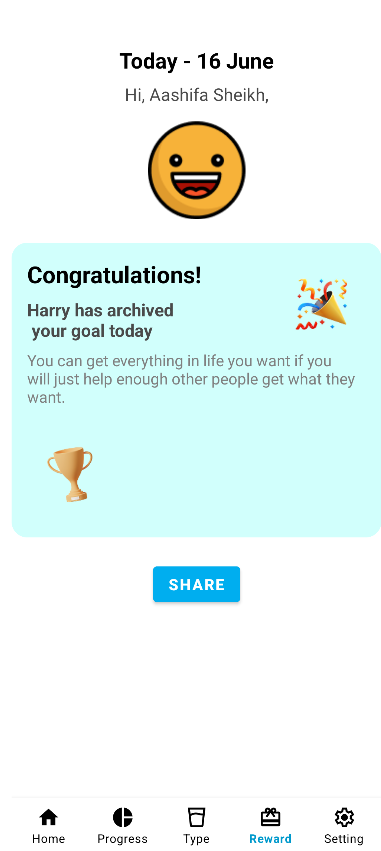
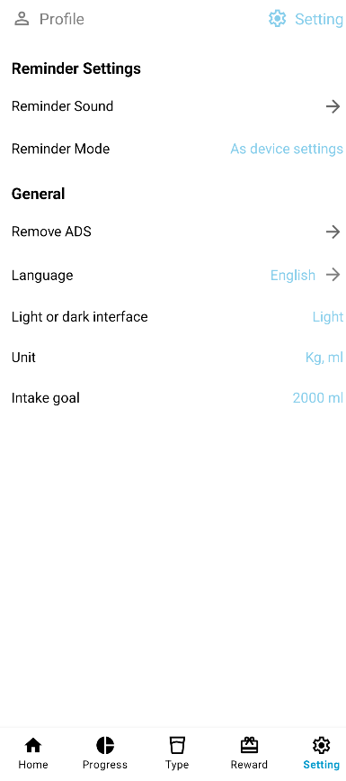
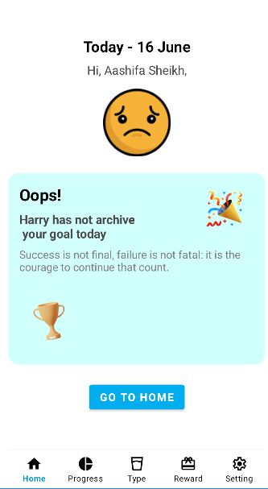

# AquaTrack - Trợ lý Uống nước Cá nhân (<!-- Thay đổi tên nếu muốn -->)

<!-- Thêm một logo hoặc banner đẹp nếu có -->
<!-- Ví dụ: 

 -->

**AquaTrack** là ứng dụng di động giúp bạn theo dõi lượng nước uống hàng ngày, xây dựng thói quen hydrat hóa lành mạnh và theo dõi các chỉ số sức khỏe liên quan một cách dễ dàng và trực quan.

<!--  -->
<!--  -->
<!-- Bỏ comment và thay link nếu bạn đã đưa lên Store -->

## Tính năng nổi bật ✨

*   💧 **Theo dõi nước uống:** Dễ dàng ghi lại lượng nước uống và theo dõi tiến độ so với mục tiêu hàng ngày.
*   📊 **Thống kê chi tiết:** Xem biểu đồ trực quan về lượng nước tiêu thụ hàng ngày và hàng tuần.
*   🍹 **Đa dạng loại đồ uống:** Ghi lại không chỉ nước lọc mà còn cả trà, cà phê, nước trái cây.
*   🏆 **Phần thưởng & Động lực:** Nhận thông báo chúc mừng khi đạt mục tiêu và theo dõi thành tích.
*   ⏰ **Nhắc nhở thông minh:** Thiết lập nhắc nhở uống nước tùy chỉnh để không bao giờ quên.
*   ❤️ **Theo dõi sức khỏe:** Theo dõi các chỉ số liên quan như số bước chân, calo, giấc ngủ, nhịp tim (nếu ứng dụng hỗ trợ).
*   ⚙️ **Tùy chỉnh cá nhân:** Điều chỉnh mục tiêu uống nước, đơn vị đo, ngôn ngữ, giao diện sáng/tối và cài đặt nhắc nhở.
*   👤 **Quản lý hồ sơ:** Cập nhật thông tin cá nhân.

## Ảnh chụp màn hình 📸

<!-- Thay thế các link ảnh hoặc mô tả bằng ảnh thực tế của bạn -->
<!-- Sử dụng table để sắp xếp hoặc đặt các ảnh liên tiếp -->

| Màn hình Home (Trạng thái)           | Màn hình Tiến độ (Progress)        | Màn hình Loại đồ uống (Type)   |
| :----------------------------------: | :--------------------------------: | :----------------------------: |
|     |  |  |

| Màn hình Phần thưởng (Rewards)       | Màn hình Cài đặt (Settings)         |
| :----------------------------------: | :---------------------------------: |
|  |  |
|  | <!-- Có thể thêm ảnh khác --> |

## Mô tả các màn hình chính 📝

### 🏠 Home (Trạng thái)

Màn hình chính cung cấp cái nhìn tổng quan nhanh chóng:
*   Lời chào cá nhân hóa.
*   Hiển thị tiến độ uống nước hiện tại so với mục tiêu hàng ngày (dạng % và ml/ml).
*   Thời gian nhắc nhở tiếp theo.
*   Lượng nước vừa uống gần nhất.
*   (Tùy chọn) Hiển thị các chỉ số sức khỏe liên quan như: Số bước đi (Walk), Calo tiêu thụ (Calories), Thời gian ngủ (Sleep), Nhịp tim (Heart).
*   Nút "+" để nhanh chóng thêm lượng nước đã uống.

### 📈 Progress (Tiến độ)

Theo dõi quá trình hydrat hóa của bạn theo thời gian:
*   Biểu đồ cột trực quan hiển thị tổng lượng nước tiêu thụ cho mỗi ngày trong tuần hiện tại (Thứ 2 - Chủ Nhật).
*   Cho phép điều hướng qua lại giữa các tuần để xem lịch sử.
*   Phần "Goal Preview" (Xem trước Mục tiêu) có thể hiển thị đánh giá hiệu suất (vận động, nhận thức) dựa trên việc hoàn thành mục tiêu.

### 💧 Type (Loại đồ uống)

Cho phép ghi lại các loại đồ uống khác nhau đã tiêu thụ:
*   Các nút/thẻ để chọn nhanh các loại phổ biến như Nước lọc (Water), Trà (Tea), Cà phê (Coffee), Nước trái cây (Juice).
*   Giúp người dùng có cái nhìn đầy đủ hơn về tổng lượng chất lỏng nạp vào cơ thể.

### 🏆 Rewards (Phần thưởng)

Màn hình tạo động lực và ghi nhận thành tích:
*   Hiển thị thông báo "Chúc mừng!" (Congratulations!) kèm biểu tượng vui vẻ khi người dùng hoàn thành mục tiêu uống nước trong ngày.
*   Hiển thị thông báo "Tiếc quá!" (Oops!) kèm biểu tượng mặt buồn nếu chưa đạt mục tiêu, cùng lời động viên.
*   Giúp củng cố thói quen tích cực.

### ⚙️ Settings (Cài đặt)

Nơi người dùng tùy chỉnh trải nghiệm ứng dụng:
*   **Cài đặt nhắc nhở:** Thay đổi âm thanh, chế độ nhắc nhở.
*   **Chung:** Quản lý quảng cáo (nếu có), thay đổi ngôn ngữ (ví dụ: English), chọn giao diện Sáng/Tối (Light/Dark), thiết lập đơn vị đo (ví dụ: Kg, ml).
*   **Mục tiêu (Intake goal):** Điều chỉnh mục tiêu lượng nước uống hàng ngày.
*   **Hồ sơ (Profile):** (Thường truy cập qua biểu tượng Profile) Cho phép chỉnh sửa thông tin cá nhân.

## Công nghệ sử dụng 💻 (Tùy chọn)

*   Ngôn ngữ: Java 
*   Nền tảng: Android
*   Database: Firebase Firestore 

## Cách cài đặt & Chạy 🚀 (Tùy chọn - nếu là mã nguồn mở)

1.  Clone repository: `git clone https://github.com/TranHuuDat2004/Water_Reminder/`
2.  Mở dự án bằng Android Studio.
3.  Thêm file `google-services.json` của bạn (nếu dùng Firebase).
4.  Build và chạy ứng dụng.

Cảm ơn bạn đã sử dụng AquaTrack! Hãy giữ gìn sức khỏe và uống đủ nước mỗi ngày! 💪💧 